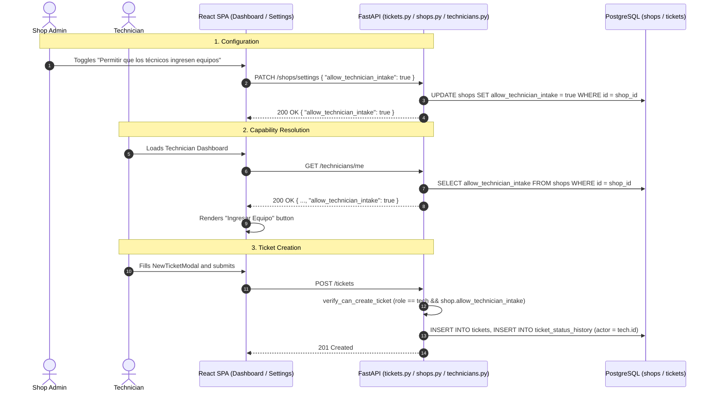

# Design: Technician Device Intake Authorization (Per-Shop Flag)

## 1. Architectural Overview
This design implements a granular, shop-configurable permission allowing technicians to create repair tickets.



## 2. Database Schema & Alembic Migration
### Table: `shops`
Add column:
```python
allow_technician_intake: Mapped[bool] = mapped_column(
    Boolean, nullable=False, server_default=sa.text("false"), default=False
)
```

### Alembic Migration
- **Revision ID**: `f6a7b8c9d0e1`
- **Down Revision**: `e5f6a7b8c9d0`
- Operations:
  - Upgrade: `op.add_column('shops', sa.Column('allow_technician_intake', sa.Boolean(), nullable=False, server_default=sa.text('false')))`
  - Downgrade: `op.drop_column('shops', 'allow_technician_intake')`

## 3. Dependency & Guard Design
### Dependency: `verify_can_create_ticket`
Lives in `backend/app/core/dependencies.py`:
- Chains `subscription_guard` to guarantee valid, active subscription.
- Checks `current_user.role`:
  - `UserRoleEnum.admin`: returns `current_user`.
  - `UserRoleEnum.technician`: queries `Shop.allow_technician_intake`. If True, returns `current_user`. Otherwise raises `HTTPException(403, detail="No tienes permiso para ingresar equipos en esta tienda.")`.
  - Any other role: raises `HTTPException(403)`.

## 4. API Schemas & Endpoints Contract
### Endpoints in `backend/app/routers/shops.py`:
- `GET /shops/settings`:
  - Guard: `subscription_guard`
  - Response: `ShopSettingsResponse(allow_technician_intake=bool)`
- `PATCH /shops/settings`:
  - Guard: `admin_guard`
  - Payload: `ShopSettingsUpdate(allow_technician_intake=bool)`
  - Response: `ShopSettingsResponse(allow_technician_intake=bool)`

### Endpoint in `backend/app/routers/technicians.py`:
- `GET /technicians/me`:
  - Response: `TechnicianMeResponse` augmented with `allow_technician_intake: bool = False`.

### Endpoint in `backend/app/routers/tickets.py`:
- `POST /tickets`:
  - Replaces `Depends(subscription_guard)` with `Depends(verify_can_create_ticket)`.

## 5. Frontend Integration
1. **API Client (`frontend/src/api/shop.js`)**:
   - Add `fetchShopSettings()` and `updateShopSettings(payload)`.
2. **Admin Settings Modal (`SlaSettingsModal.jsx`)**:
   - Add a dedicated section with a toggle switch:
     - Label: "Permitir que los técnicos ingresen equipos"
     - Subtitle: "Habilita la opción de recepción e ingreso de nuevos equipos desde el panel operativo de técnicos."
     - Sunk state persisted via `useQuery` / `useMutation`.
3. **Technician Dashboard (`TechnicianDashboard.jsx`)**:
   - Inspect `techProfile?.allow_technician_intake && !isReadOnly`.
   - If true, display "Ingresar Equipo" button that mounts `NewTicketModal`.
