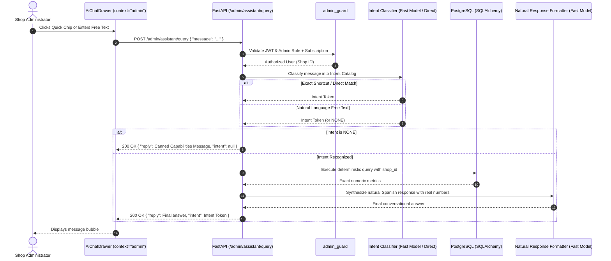

# Design: Ohm Administrative Assistant (Shop-Level Analytics & Inquiries)

## 1. Architectural Overview
This architecture implements a closed-intent conversational assistant for workshop administrators. Free text or predefined shortcuts are evaluated through an intent classifier, executing deterministic, tenant-isolated SQL queries, and formatting the response via a lightweight model.



## 2. Intent Catalog Specification (v1)

| Intent Token | Description | Deterministic Metric Definition |
| :--- | :--- | :--- |
| `ganancias_del_dia` | Total workshop revenue collected today | `SUM(total_cost)` for tickets where `shop_id == current_user.shop_id`, `status == LISTO_PARA_RETIRAR`, and `updated_at >= start_of_today` |
| `equipos_ingresados_hoy` | Volume of tickets registered today | `COUNT(id)` for tickets where `shop_id == current_user.shop_id` and `created_at >= start_of_today` |
| `equipos_sin_tocar` | Active tickets lacking attention > 48h | `COUNT(id)` and summary list for tickets where `shop_id == current_user.shop_id`, `status IN (EN_ESPERA_INGRESO, EN_REVISION, ESPERANDO_APROBACION, ESPERANDO_REPUESTO, EN_REPARACION)`, and `updated_at <= now - 48 hours` |
| `NONE` | Unrecognized query / out of catalog | No database query executed. Returns canned support guide. |

## 3. Backend Implementation Details

### Router & Endpoint
- **File**: `backend/app/routers/admin_assistant.py`
- **Route**: `POST /admin/assistant/query`
- **Security Dependency**: `Depends(admin_guard)`
- **Request Schema**:
  ```python
  class AdminAssistantQueryRequest(BaseModel):
      message: str = Field(..., min_length=1, max_length=500)
  ```
- **Response Schema**:
  ```python
  class AdminAssistantQueryResponse(BaseModel):
      reply: str
      intent: str | None = None
  ```

### Service Layer
- **File**: `backend/app/services/admin_assistant_service.py`
  - `classify_intent(message: str) -> str`: Uses pattern matching first (O(1) for known chips), falls back to `gemini-3.5-flash-lite`.
  - `execute_intent_query(db: AsyncSession, shop_id: UUID, intent: str) -> dict`: Runs the exact SQL query.
  - `format_response(intent: str, data: dict, user_message: str) -> str`: Synthesizes the natural Spanish response.

## 4. Frontend Integration Details

### Reusable Component: `AiChatDrawer.jsx`
- Introduce `context` prop: `"ticket"` (default) | `"admin"`.
- When `context === "admin"`:
  - Header displays "Ohm • Asistente de Gestión" with subtitle "Métricas y Operaciones del Taller".
  - Renders 3 quick-action chips above the input:
    - 💰 Ganancias de hoy
    - 📥 Equipos ingresados hoy
    - ⏱️ Equipos sin tocar
  - Clicking any chip sends the corresponding message immediately.
  - Hides ticket diagnostic context (no ticket switcher, no RAG confirmation, no diagnostic draft buttons).
  - Uses `sendAdminAssistantQuery(message)` to hit `/admin/assistant/query`.

### Integration in `AdminDashboard.jsx`
- Import `AiChatBubble` and `AiChatDrawer`.
- Maintain drawer state `isAiDrawerOpen` in `AdminDashboard`.
- Render `AiChatBubble` at bottom right.
- Render `AiChatDrawer` with `context="admin"`.
