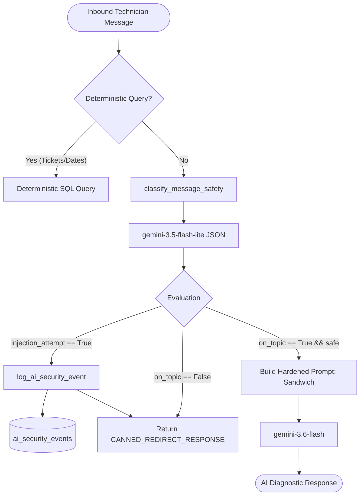

# Design: Ohm Scope Restriction & Anti Prompt-Injection Architecture

## Architectural Overview

The solution introduces a pre-execution safety gate between the HTTP/Service layers and the core reasoning LLM / RAG pipeline.



## Component Architecture

### 1. Database Model (`app/models/ai_security_event.py`)
```python
class AiSecurityEvent(Base):
    __tablename__ = "ai_security_events"

    id: Mapped[uuid.UUID] = mapped_column(UUID(as_uuid=True), primary_key=True, default=uuid.uuid4)
    shop_id: Mapped[uuid.UUID] = mapped_column(UUID(as_uuid=True), ForeignKey("shops.id", ondelete="CASCADE"), nullable=False, index=True)
    technician_id: Mapped[uuid.UUID | None] = mapped_column(UUID(as_uuid=True), ForeignKey("technicians.id", ondelete="SET NULL"), nullable=True, index=True)
    ticket_id: Mapped[uuid.UUID | None] = mapped_column(UUID(as_uuid=True), ForeignKey("tickets.id", ondelete="SET NULL"), nullable=True, index=True)
    event_type: Mapped[str] = mapped_column(String(50), nullable=False, default="injection_attempt")
    message_excerpt: Mapped[str] = mapped_column(String(280), nullable=False)
    created_at: Mapped[datetime] = mapped_column(DateTime(timezone=True), server_default=func.now(), nullable=False)
```

### 2. Safety Service Module (`app/services/ai_safety_service.py`)
Encapsulates:
- `MessageSafetyResult(BaseModel)`: Pydantic schema with `on_topic: bool` and `injection_attempt: bool`.
- `build_safety_classification_prompt(message: str) -> str`: Builds system instructions for the classification task.
- `classify_message_safety(message: str, client: genai.Client | None = None) -> MessageSafetyResult`: Calls `gemini-3.5-flash-lite` with structured output schema (`response_mime_type="application/json"`).
- `log_ai_security_event(...)`: Persists security incident into `ai_security_events`.
- `CANNED_REDIRECT_RESPONSE`: Constant string for neutral redirection.
- `build_hardened_sandwich_prompt(base_prompt: str, user_message: str) -> str`: Helper constructing prompt with initial and terminal anti-injection guards.

### 3. Integration Handlers
- **`workshop_diagnostic_chat` ([diagnostic.py](file:///C:/Users/cntmi/Desktop/Tecnidesk/backend/app/routers/diagnostic.py)):**
  Checks deterministic queries -> calls `classify_message_safety` -> if injection or off-topic, returns `DiagnosticMessageResponse` with `model_route="safety_guard"` and `model="canned"` -> otherwise invokes Gemini with hardened prompt.
- **`handle_chat_message` ([correction_service.py](file:///C:/Users/cntmi/Desktop/Tecnidesk/backend/app/services/correction_service.py)):**
  Saves user message -> calls `classify_message_safety` -> if injection, logs with `shop_id, technician_id, ticket_id` -> saves and returns canned assistant response -> otherwise calls reasoning model with hardened prompt.

### 4. Failure Modes & Resilience
- If the safety classifier LLM fails due to timeout or network error, it logs an alert and fails open (`on_topic=True, injection_attempt=False`) so diagnostic work is not blocked by intermittent classifier degradation, while base system prompt defenses remain active.
